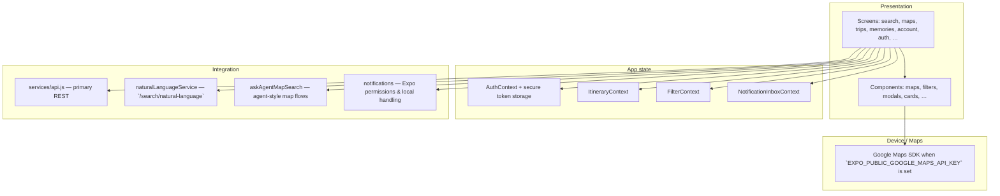
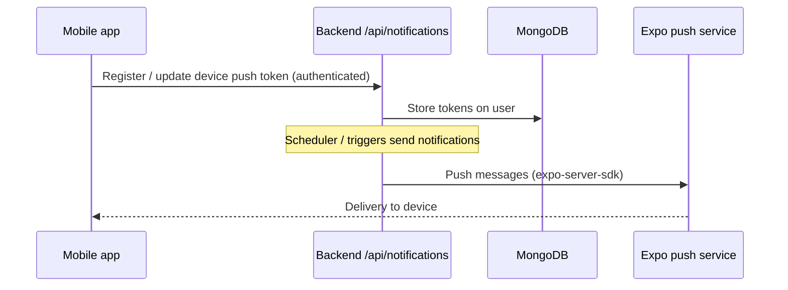

# Overlap — Mobile & Backend Architecture

This document describes how the **Expo / React Native** mobile app (`mobile-app/`) and the **Express** API (`backend/`) fit together. The **web** app is out of scope here.

---

## System context

```mermaid
flowchart LR
  subgraph mobile["Mobile app (Expo)"]
    UI["Screens, components"]
    NAV["React Navigation"]
    CTX["Contexts (auth, itinerary, filters, notifications)"]
    API_CLIENT["REST client + helpers"]
    UI --> NAV
    NAV --> UI
    UI --> CTX
    CTX --> API_CLIENT
  end

  subgraph backend["Backend (Node / Express)"]
    HTTP["`/api/*` routes"]
    MID["Middleware (auth, rate limits, CORS)"]
    SVC["Services & providers"]
    HTTP --> MID
    MID --> SVC
  end

  DB[(MongoDB)]

  subgraph third["External services"]
    EXPO_PUSH["Expo Push"]
    WORKOS["WorkOS (optional SSO)"]
    API_SPORTS["API-Sports (fixtures)"]
    LOC["LocationIQ (geocoding)"]
    AMAD["Amadeus (flights, when configured)"]
    CLOUD["Cloudinary (media, when configured)"]
    MAIL["Email provider (via emailService)"]
  end

  API_CLIENT <-->|HTTPS JSON<br/>Bearer JWT when logged in| HTTP
  SVC --> DB
  SVC --> API_SPORTS
  SVC --> LOC
  SVC -.-> AMAD
  SVC -.-> CLOUD
  SVC -.-> MAIL
  SVC -.-> WORKOS
  SVC --> EXPO_PUSH
  EXPO_PUSH -.->|"device notification"| mobile
```

**Configuration:** The app resolves `EXPO_PUBLIC_API_URL` (see `mobile-app/services/api.js`); production builds must define it explicitly.

---

## Mobile app (logical layers)



---

## Backend — HTTP surface

Routes are mounted in `backend/src/app.js` under **`/api`**.

```mermaid
flowchart LR
  Client["Mobile app"]

  subgraph routes["`/api` route groups"]
    R1["`/auth` — register, login, JWT, WorkOS SSO"]
    R2["`/matches`, `/teams`, `/leagues`, `/venues`"]
    R3["`/search` — search + natural-language planning"]
    R4["`/trips`, `/preferences`, `/recommendations`"]
    R5["`/memories`, `/feedback`"]
    R6["`/notifications` — inbox + push orchestration"]
    R7["`/transportation`, `/attendance`, attended matches"]
    R8["`/admin`"]
  end

  DB[(MongoDB)]

  Client --> routes
  routes --> DB
```

**Cross-cutting:** `helmet`, CORS, JSON body limits, and rate limiting (`/api` plus stricter `/api/auth`). Static uploads are served from `/uploads` when used.

---

## Push notifications path



---

## Diagram maintenance

- **Edit** the Mermaid blocks in this file when you add routes or major integrations.
- **Preview:** use your editor’s Mermaid preview, or paste into [mermaid.live](https://mermaid.live) for PNG/SVG export.
